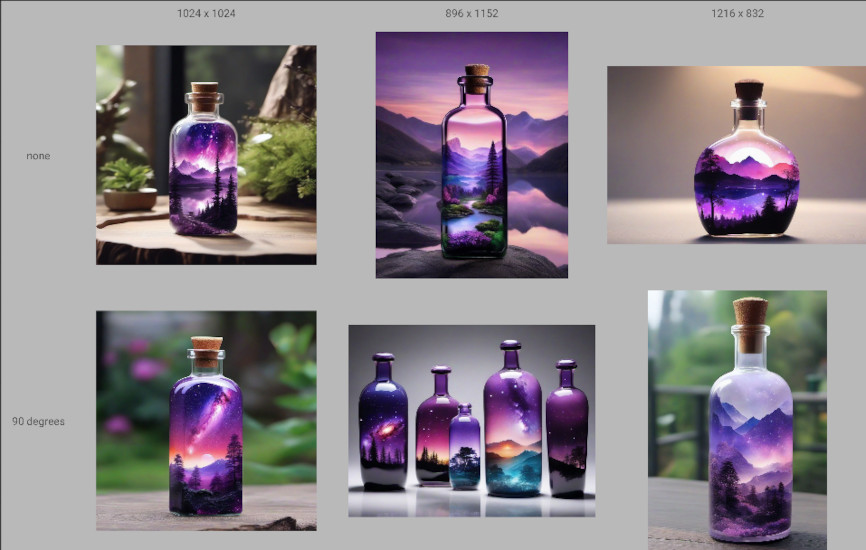

# Examples / XY Plot / Various resolutions (and aspect ratios)

> [!NOTE]
> These examples are intended for quick re-use, feel free to check [the tutorials](../../../tutorials/) for more detailed explanations.

Sections:

- [Overview](#overview)
- [Workflow](#workflow)

> [!TIP]  
> Here we do not customize the grid look, but it can be done easily by plugging the `Plot Config: Grid` and/or `Plot Config: Header/Footer` nodes to `XY Plot: Render`.\
> More details in the [node reference](../../../node%20reference/xy%20plot/2%20-%20config%20nodes.md) and the [XY Plot tutorial 2 - pimp my grid](../../../tutorials/XY%20Plot/2%20-%20pimp%20my%20grid/).

## Overview

While probably not the most useful as such, this example demonstrates the ability of the ComfyLab XY Plot to handle various resolutions or aspect ratios within the same grid.

Here we generate images of various resolutions, and apply rotations.

## Workflow

**Load either `various resolutions.json` or `various resolutions.png` into ComfyUI.**\
Adjust the checkpoint to one available in your ComfyUI instance.\
Execute the workflow.

What we did:

- included the ComfyLab `Resolution to Dimensions` node, to split the first input (`1024 x 1024`, ...) into width and height, piped into `Empty Latent Image`
  - we could have done this differently, I chose this method as it is straightforward in this case
- we also used a 2nd input list to set rotations, piped into the `rotation` input of `Rotate Latent`
  - remember, we can do that because the `Queue` outputs are of type Any
