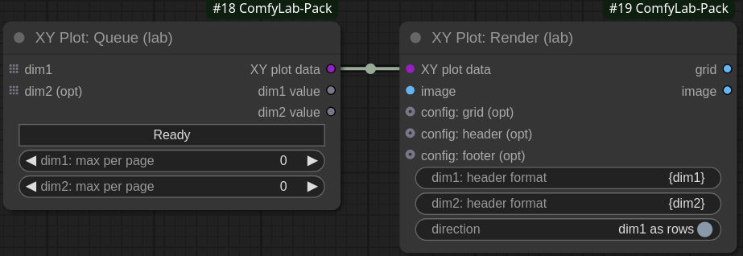

# Node reference / XY Plot: 0 - Core concepts

As a minimum, to use the `XY Plot`, you need to integrate 2 nodes, `XY Plot: Queue` and `XY Plot: Render`: the first one will organize the queue, the second one will render the grid(s).

They must be connected by the specific `XY plot data` link : that is the way the queue can inform the render node about the current processing state.

What is processed between them (from `dim1 value` / `dim2 value` outputs of `Queue` to `image` input in `Render`) is for you to choose: as such, **the ComfyLab's XY Plot approach is totally process-independent**.

## XY Plot: Queue

As you can see in the screenshot, there is no concept of row / column or X / Y in the `Queue` node, as in many other plot / grid implementations:

Instead, we talk about `dim1` and `dim2` (dimensions 1 & 2): this is intended, to improve performance: but we'll talk about that later.

> [!IMPORTANT]
> just remember this rule: **for a given `dim1` value, we process all values of `dim2` before switching to the next `dim1` value**
> whether `dim1` and `dim2` are rows or columns is configured later, in the `Render` node (`direction` toggle)

`dim1` and `dim2` (optional) **take lists as inputs**:

- in ComfyUI, a LIST is a LIST, but we cannot know if it's a list of strings, numbers, images, ...
- so another important rule: **what you send is what you get**
  - said differently: if you send a list of numbers, you will get number values in output
  - or one could say: sh\*t in, sh\*t out...

For the reason above, the `Queue` node cannot determine what it will get in input, so **the type of the outputs is set to `"*"` (Any)**.\
This makes the `dim1 value` and `dim2 value` outputs very versatile, as you can basically connect them anywhere.

But it comes ar a price:

> [!WARNING]
> You must ensure that the **data in input correspond to the expected data in output**\
> For example: if you connect `dim1 value` to the `cfg` input of `KSampler`, you must ensure that the input list is a list of floats.\
> If you send strings, you will obviously get an error when running the workflow

One of the main features of the `Queue` node is **auto-queuing**

- no need to reset a counter, or manually increase the batch size
- **the `Queue` node will take care of that for you**
- in fact, you should definitely **not set the batch size to anything else than `1`**

## XY Plot: Render

The `Render` node, in its default configuration is easier to understand:

It takes an `image` as input, for example the result of the `KSampler` processing

> [!IMPORTANT]
> You are not limited to KSampler:
>
> - in fact **you can do what you want between the `Queue` node and the `Render` one**
> - it could be loading the image from a folder, doing some image transformations... you decide

This node has 2 outputs:

- `image` is the single image, as received in input
- `grid` is the generated grid, when it has received enough images
  - obviously, you can generate multiple grids, if you configure pagination in the `Queue` node

## dim1 vs dim2, which one should I choose? (or the Performance Question)

As seen above, connecting an input list on either `dim1` or `dim2` doesn't determine if data will be displayed as rows or columns: you can simply switch the `direction` in the `Render` node.

So, what does it change?\
In the most simple cases, for example if you plot `CFG` vs `seed`, it should not have any visible impact.

But now, imagine a more advanced case: I want to plot a given list of 3 seeds vs a list of 3 checkoints with the default `KSampler` workflow.\
Let's recall the rule above: **for a given `dim1` value, we process all values of `dim2` before switching to the next `dim1` value**.\
That means that, if I set the list of seeds in `dim1`, the process will work as follows:

- get seed #1, get checkpoint #1 > <ins>load checkpoint #1</ins> > render image
- **keep** seed #1, get checkpoint #2 > <ins>load checkpoint #2</ins> > render image
- **keep** seed #1, get checkpoint #3 > <ins>load checkpoint #3</ins> > render image
- get seed #2, get checkpoint #1 > <ins>load checkpoint #1</ins> > render image
- ...

Loading a checkpoint is a costly operation, in terms of performance: we don't want to load a new checkpoint at each and every iteration.\
So let's switch, connecting the list of checkpoints to `dim1`, and the list of seeds to `dim2`:

- get checkpoint #1, get seed #1 > <ins>load checkpoint #1</ins> > render image
- **keep** checkpoint #1, get seed #2 > _do not load checkpoint #1_ (it's in memory) > render image
- **keep** checkpoint #1, get seed #3 > _do not load checkpoint #1_ (it's in memory) > render image
- ...

By doing so, we optimize the performance as much as possible.

> [!TIP]
> So as a general rule: **if you need to vary models (checkpoint, LoRA, ...), ensure these values are connected to `dim1`**.\
> (And if you vary 2 lists of models, obviously choose the slowest as `dim1`).
