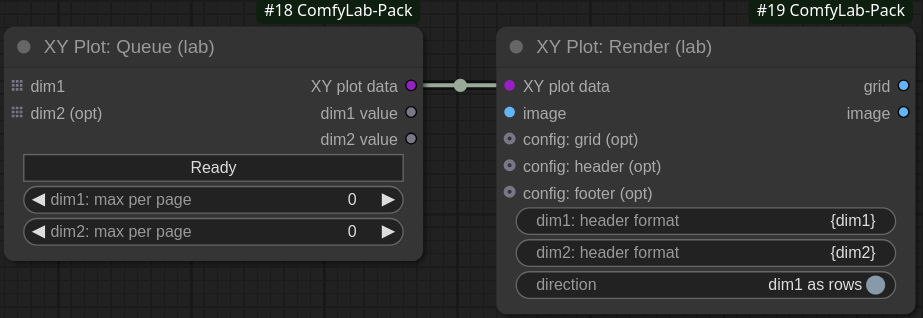

# Node reference / XY Plot: 01 - Queue and Render

**Work in Progress**

## Node overview

### XY Plot: Render

As per the widgets:

- `dim1: header format` and `dim2: header format`
  - enter here a template string, following the syntax of Python string `format()` method
  - the `{dim1}` and `{dim2}` placeholders will be replaced by the current dim1 / dim2 value
  - very handy if you want to prefix the row / column headers, for example:
    - if you have CFG values in dim1, by default the headers will be `7.5`, `8`, ...
    - just change the dim1 header format to `CFG: {dim1}` and you will get: `CFG: 7.5`, `CFG: 8`, ...
  - there are plenty of advanced techniques, but you will probably not use them here
    - however if you want to learn more, you can check the [`Format` node reference](../format.md)
- `direction`: whether dim1 values are displayed as rows, or columns
