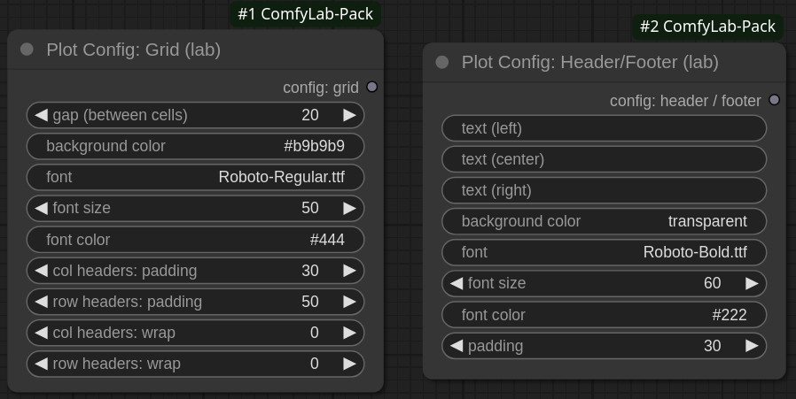

# Node reference / XY Plot: 2 - Config nodes

## Overview

In addition to the standard [Queue and Render nodes](./1%20-%20queue%20and%20render.md), you can customize many visual aspects of the grid, thanks to 2 optional nodes, `Plot Config: Grid` and `Plot Config: Header/Footer`, than can be plugged into `XY Plot: Render`.\
They allow you to customize the grid, and either the page header or footer (or both), all configurable separately.

> [!TIP]
> To see them in action, please refer to [tutorial #2 - pimp my grid](../../tutorials/XY%20Plot/2%20-%20pimp%20my%20grid/).

While some configuration options are specfic, they share some similarities:

### Font

You can specify the font type, as well as its size and color.

The font type can be either:

- one of the 4 fonts shipped with the extension: _Roboto-Regular.ttf_ / _Roboto-Bold.ttf_ / _Roboto-Italic.ttf_ / _Roboto-BoldItalic.ttf_,
- or the full path to a locally-installed TTF font

The color can expressed either as RGB hex notation (e.g. `#e9e9e9`), or by name (e.g. `blue`).

### Background color

As for the font color, you can use either the RGB hex notation, or a color name.

In addition, **you can also use the special value `transparent`**:

- in the `Plot Config: Header/Footer`, it means the header / footer will use the same bg color as the grid
- while in `Plot Config: Grid`, it will make the grid RGBA
  - useful if you want to add a background image

> [!TIP]
> To see how to use a custom background image, please check the [XY Plot tytorial: 2 - pimp my grid (Part 3)](../../tutorials/XY%20Plot/2%20-%20pimp%20my%20grid/)

## Plot Config: Grid

### Widgets / Outputs

#### Widgets

|                  input name                   |  type  |                                    description                                    | comment                                                                          |
| :-------------------------------------------: | :----: | :-------------------------------------------------------------------------------: | :------------------------------------------------------------------------------- |
|                      gap                      |  INT   |                          gap between grid cells (pixels)                          |                                                                                  |
|               background colot                | STRING |                                 background color                                  | use `transparent` to render the grid as RGBA                                     |
|                     font                      | STRING |                                     font type                                     | either one the 4 standard fonts or full path to a locally-installed TTF font |
|                   font size                   |  INT   |                                font size (pixels)                                 |                                                                                  |
|                  font color                   | STRING |                                    font color                                     | either RGB hex notation or color name                                            |
| col headers: padding row headers: padding |  INT   | padding to apply to row/col headers vertically and horizontally, respectively |                                                                                  |
|    col headers: wrap row headers: wrap    |  INT   |                  number of characters before wrapping (new line)                  | "smart wrap" when possible (break on hyphens)                                    |

#### Outputs

| output name  |       type       | description | comment                     |
| :----------: | :--------------: | :---------: | :-------------------------- |
| config: grid | PLOT_CONFIG_GRID | grid config | linked to `XY Plot: Render` |

## Plot Config: Header/Footer

### Widgets / Outputs

#### Widgets

|                   input name                   |  type  |                                    description                                    | comment                                                                          |
| :--------------------------------------------: | :----: | :-------------------------------------------------------------------------------: | :------------------------------------------------------------------------------- |
| text (left) text (center) text (right) | STRING | text to include in the header or footer at left / center / right respectively | also aligned depending on position                                               |
|                background colot                | STRING |                                 background color                                  | use `transparent` to use the same as grid                                        |
|                      font                      | STRING |                                     font type                                     | either one the 4 standard fonts or full path to a locally-installed TTF font |
|                   font size                    |  INT   |                                font size (pixels)                                 |                                                                                  |
|                   font color                   | STRING |                                    font color                                     | either RGB hex notation or color name                                            |
|                    padding                     |  INT   |                       vertical padding above and below text                       |                                                                                  |

#### Outputs

|       output name       |      type      |         description          | comment                     |
| :---------------------: | :------------: | :--------------------------: | :-------------------------- |
| config: header / footer | PLOT_CONFIG_HF | page header or footer config | linked to `XY Plot: Render` |
