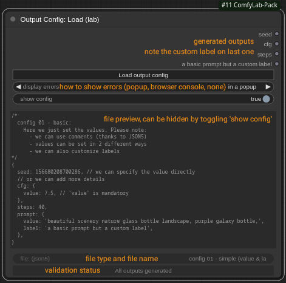

# Tutorials / Output Config: 01 - simple (value & label)

In this first tutorial, we demonstrate the use of `Output Config: Load` with the good old KSampler workflow, and some basic output configuration.

## Let's play

### Init the workflow

- download and open file `wortkflow.json` or `workflow.png` (in current repo folder), in ComfyUI
- or start with the default KSampler workflow, and just add node `Output Config: Load`

### Create the outputs from config

- download any of the `config 01 - *` config files in your favorite format: json, json5, or YAML
  - json5 and yaml allow comments, standard json doesn't
- in `Output Config: Load`, click on `Load output config`, and load the config file

At this point, you should see something like this (example with the `.json5` config file):



> Note: the label for the 4th output has been customized according to our config

### Connect the dots and eun the workflow

Connect each of the outputs:

- 'seed' to `KSampler` / seed
- 'cfg' to `KSampler` / cfg
- 'steps' to `KSampler` / steps
- 'a basic prompt but a custom label' to `CLIP: Text Encode` (the positive one obviously)

Run the prompt: click the main blue `Queue` buttom.

## Adjust to your liking

Modify the config files, change the prompt, or any value as you wish. Enjoy, there is plenty to do at this stage already!

## Going off the limits

If you want to play with the `display errors` setting: \
Change the `value` key in `cfg` or `prompt` to anything else, like `not_value`:

```json
   "not_value": "beautiful scenery nature glass bottle landscape, purple galaxy bottle,",
```

This will raise an error: depending on the settings in `error display`, it will be:

- displayed in a popup,
- displayed in your browser console (F12 in Firefox and probably others),
- ignored
